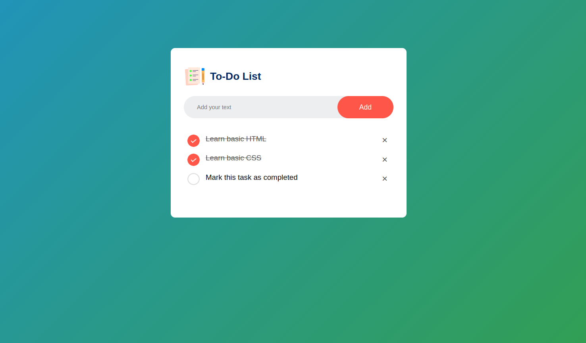

<h1 align="center">
  
   
  To-Do List
</h1>

<h1 align="center">

</h1>

App to learn the basics of Web development

🤝 thanks to [How To Create To-Do List App Using HTML CSS And JavaScript | Task App In JavaScript](https://www.youtube.com/watch?v=G0jO8kUrg-I)